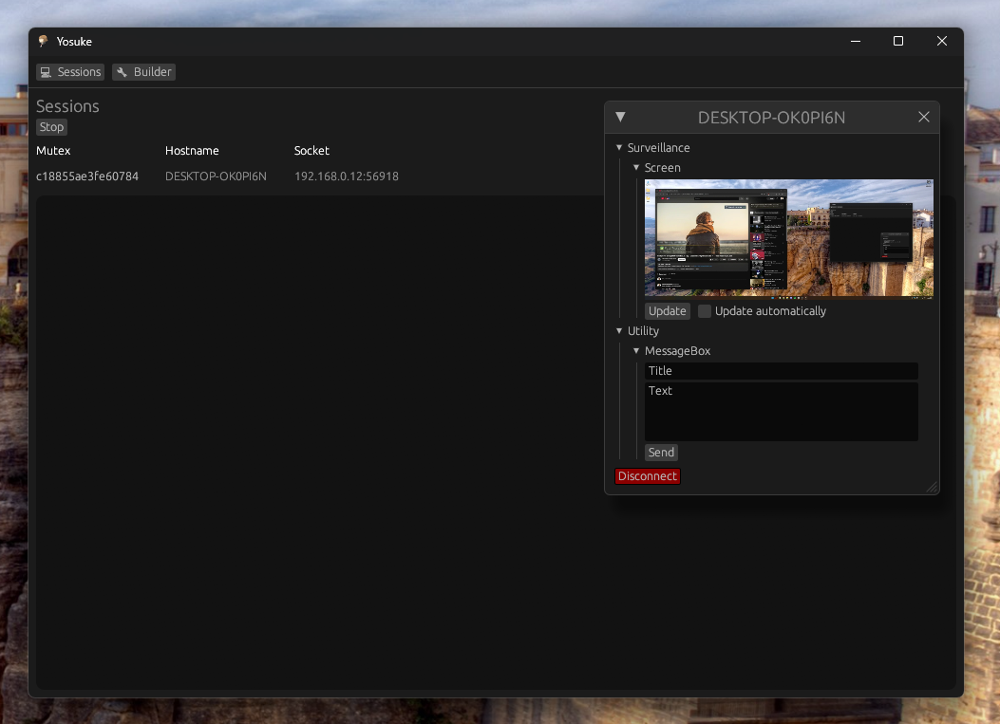

<p align="center">
    
</p>
<p align="center">
    i hate this stupid brat so his name is shared with my rat
</p>

---

# detailing Yosuke
## current features
- screenshot of client
- - automatic update at ~3fps
- send MessageBox
- disconnect
## future features
- audio capture
## server
- relies on egui/eframe for the interface
- relies on tokio for networking and threading
- uses mpsc channels to communicate between threads
### builder
the builder code simply takes the unpatched client bin (renamed to stub.dat) and looks for a pre-made empty spot in the binary to inject a key + encrypted config.
## client
- relies on smol for networking and threading (this unfortunately did not reduce file size at all, i could've just stayed with tokio)
## encryption
honest to god i've completely forgotten how i wrote the encryption for this rat, it just works.

# building Yosuke
## server
cross-platform
```
cargo build --release --bin server
```
## client
windows only
```
cargo build --release --bin client
```

---



